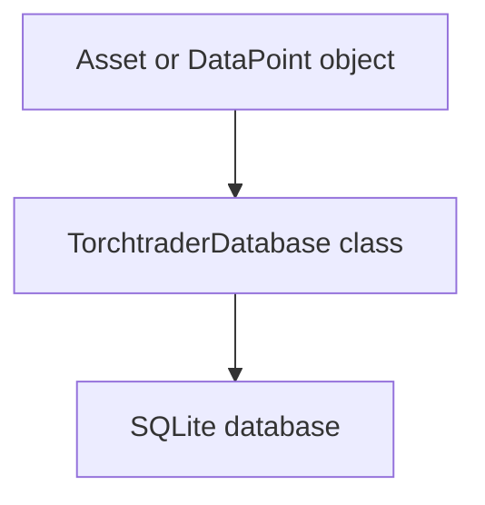

# **Torchtrader Database Module Documentation**

The `database.py` module is responsible for managing database operations for Torchtrader. It defines two models, `Asset` and `DataPoint`, and a `TorchtraderDatabase` class to manage database operations.


## **Flowchart**

The following flowchart illustrates the flow of data in the `database.py` module:





## **Models**


### **Asset**

The `Asset` model represents an asset in the database. It has the following attributes:


* `id`: Integer primary key autoincremented.
* `asset_id`: String of maximum length 20, not nullable, and unique.
* `base_currency`: String of maximum length 20, not nullable.
* `quote_currency`: String of maximum length 20, not nullable.
* `is_crypto`: Integer of 0 or 1, not nullable, default 1.
* `data_points`: Relationship with `DataPoint` model.


### **DataPoint**

The `DataPoint` model represents a data point for an asset in the database. It has the following attributes:


* `id`: Integer primary key autoincremented.
* `asset_id`: Integer foreign key to `Asset` model, not nullable.
* `date_time`: DateTime not nullable.
* `open`: Float not nullable.
* `high`: Float not nullable.
* `low`: Float not nullable.
* `close`: Float not nullable.
* `volume`: Float not nullable.
* `asset`: Relationship with `Asset` model.


## **TorchtraderDatabase class**

The `TorchtraderDatabase` class is responsible for managing database operations. It has the following methods:


```
__init__()
```


Initializes the `TorchtraderDatabase` class and creates tables if they don't exist.


```
add_asset(asset: Dict[str, Any]) -> int | None
```


Adds an asset to the database.

Args:


* `asset` (Dict[str, Any]): A dictionary containing the asset details.

Returns:


* `int`: The ID of the added asset if successful, `None` otherwise.


```
add_data_points(asset_id: int, data_points: List[Dict[str, Any]]) -> List[int]
```


Adds data points to the database for a given asset.

Args:


* `asset_id` (int): The ID of the asset for which to add data points.
* `data_points` (List[Dict[str, Any]]): A list of dictionaries containing data points.

Returns:


* `List[int]`: A list of IDs of the added data points.


```
query_data_points(asset_id: int, filters: Dict[str, Any] = None) -> List[DataPoint]
```


Query data points for a given asset with optional filters.

Args:


* `asset_id` (int): The ID of the asset for which to query data points.
* `filters` (Dict[str, Any], optional): A dictionary of filters to apply to the query. Defaults to `None`.

Returns:


* `List[DataPoint]`: A list of `DataPoint` objects matching the query.


```
get_asset(asset_id: str) -> Optional[Dict[str, Any]]
```


Gets an asset by its asset_id.

Args:


* `asset_id` (str): The asset_id of the asset to retrieve.

Returns:


* `Optional[Dict[str, Any]]`: A dictionary containing the asset details if found, `None` otherwise.


```
close_session() -> None
```


Closes the database session
