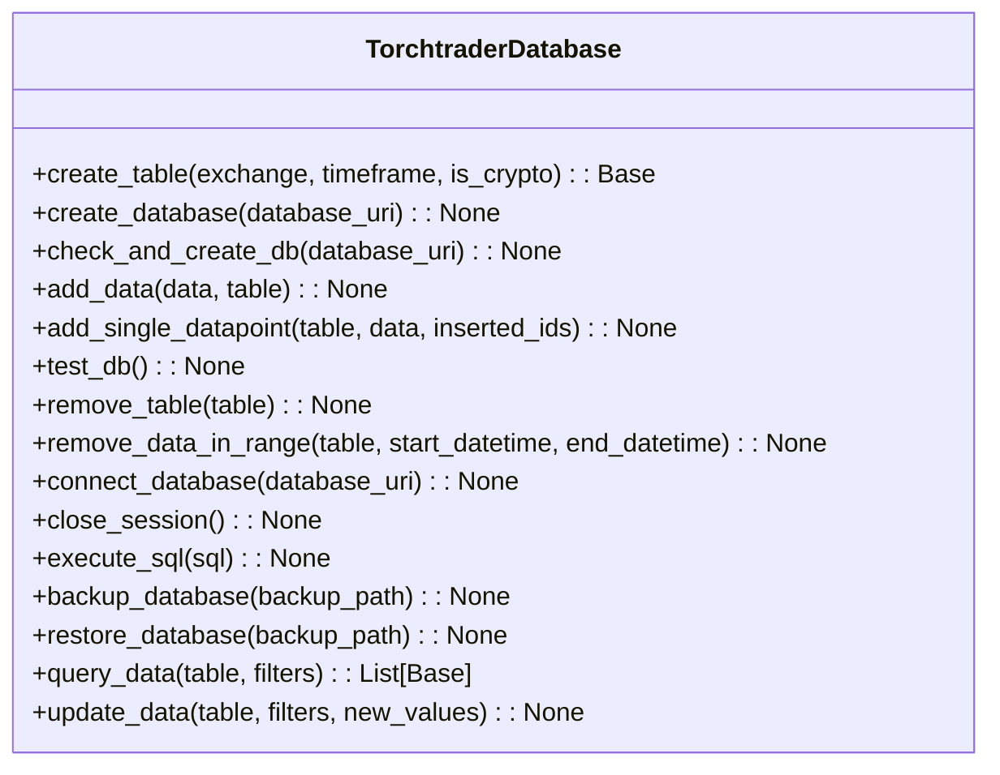

# Database
This class provides a convenient interface for managing a database to store asset price data from different exchanges and timeframes. It utilizes SQLAlchemy as the ORM and SQLite as the default database. Users can create tables for specific exchanges and timeframes, add or update data, query data, and perform basic database management tasks such as backing up and restoring the database.

Here's a high-level overview of the `TorchtraderDatabase` class:





The `TorchtraderDatabase` class offers the following methods:


* `create_table`: Creates a new table for the specified exchange and timeframe.
* `create_database`: Creates a new SQLite database at the specified URI.
* `check_and_create_db`: Checks if the database exists and creates it if necessary.
* `add_data`: Adds new data to the specified table. It can handle both single datapoints and bulk data.
* `add_single_datapoint`: Adds a single data entry to the specified table.
* `test_db`: Runs a series of tests on the database, including creating and removing test tables.
* `remove_table`: Removes the specified table from the database.
* `remove_data_in_range`: Removes data from the specified table within a given datetime range.
* `connect_database`: Connects to the specified database or creates it if it doesn't exist.
* `close_session`: Closes the current database session.
* `execute_sql`: Executes the specified SQL command.
* `backup_database`: Creates a backup of the database at the specified path.
* `restore_database`: Restores the database from the specified backup path.
* `query_data`: Queries data from the specified table with optional filters.
* `update_data`: Updates data in the specified table with the given filters and new values.

To use this class, you have to create an instance of `TorchtraderDatabase` and call the desired
methods. For example, to create a new database and add some data to a table:


```python
from torchtrader.database import TorchtraderDatabase

db = TorchtraderDatabase()
db.connect_database()
binance_table = db.create_table("binance", "1h", is_crypto=True)
data = {
    "datetime": datetime(2023, 4, 16, 12, 0, 0),
    "asset_id": "BTC",
    "base_currency": "BTC",
    "quote_currency": "USDT",
    "value": 60000,
    "exchange": "binance",
    "timeframe": "1h",
}
db.add_data(data, binance_table)
db.close_session()
```


In this example, we create a new `TorchtraderDatabase` instance, connect to the database, create a table for Binance 1-hour data, add a data entry to the table, and then close the session
