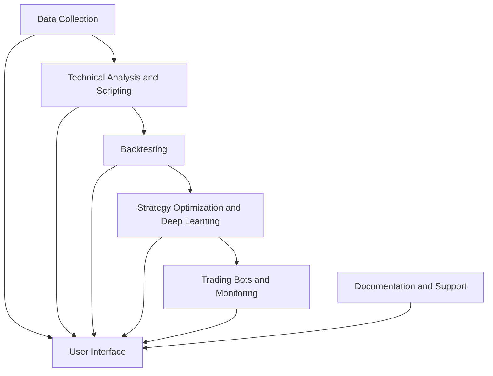
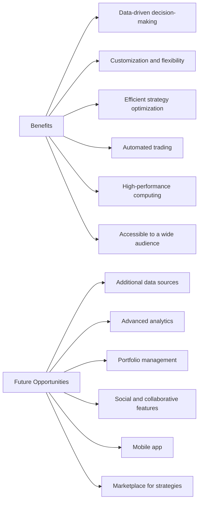

# **Torch Trader Project Proposal**

## **Executive Summary**

Torch Trader is an innovative, high-performance trading application designed to showcase cutting-edge data science and programming capabilities. The application will provide users with powerful tools for technical analysis, strategy creation, backtesting, and optimization using deep learning. Torch Trader will also incorporate trading bots to automate and monitor trades in real-time across stock and cryptocurrency markets. By leveraging the PyTorch library and CUDA computing, Torch Trader aims to deliver exceptional performance and efficiency.

## **Objectives**

1. Enable users to collect and manage financial data from stock and cryptocurrency markets.
2. Provide a comprehensive suite of technical analysis tools and scripting capabilities for strategy creation.
3. Develop a robust backtesting engine to evaluate and optimize trading strategies.
4. Implement deep learning techniques to further optimize and improve strategy performance.
5. Create and manage trading bots capable of executing trades on multiple exchanges.
6. Ensure high-performance computing and efficient resource utilization through PyTorch and CUDA integration.
7. Design a user-friendly interface that appeals to both novice and experienced traders.
8. Offer thorough documentation and support to facilitate user adoption and project maintenance.

## **Target Audience**

Torch Trader targets a wide range of users, from individual traders and enthusiasts to professional data scientists and quantitative analysts. The application aims to empower users to harness the power of advanced data analysis, deep learning, and automation to improve their trading decisions and performance.

## **Features**

* **Data Collection**: Collect and store historical and real-time financial data from stock and cryptocurrency markets using APIs such as Alpha Vantage, Yahoo Finance, and Binance.
* **Technical Analysis and Scripting**: Implement a variety of technical analysis indicators using libraries like TA-Lib and Tulipy, and allow users to create custom trading strategies with a flexible scripting engine.
* **Backtesting**: Design a backtesting engine that simulates trading with historical data to evaluate strategy performance and risk metrics.
* **Strategy Optimization and Deep Learning**: Utilize PyTorch to develop and train deep learning models for strategy optimization, incorporating reinforcement learning techniques such as DQN and PPO.
* **Trading Bots and Monitoring**: Implement trading bots capable of executing trades on various exchanges, with built-in monitoring and alert systems.
* **High-Performance Computing**: Leverage PyTorch's CUDA support for GPU acceleration and Python's multi-threading capabilities for efficient resource utilization.
* **User Interface**: Develop an intuitive user interface, either as a CLI, web-based, or desktop application.
* **Documentation and Support**: Provide comprehensive user and developer documentation, along with a maintenance and support plan.

## **Technologies**

* **Data Collection**: Alpha Vantage, Yahoo Finance, Binance APIs
* **Technical Analysis**: TA-Lib, Tulipy
* **Backtesting**: Backtrader, PyAlgoTrade, Zipline
* **Deep Learning**: PyTorch, CUDA
* **Trading Bots**: Exchange APIs (e.g., Binance, Coinbase)
* **Multi-threading**: `concurrent.futures`, `asyncio`
* **User Interface**: Flask, Django, PyQt, Tkinter
* **Documentation**: MkDocs, Mermaid

## **Benefits**

Torch Trader will showcase the power of modern data science techniques and programming expertise to deliver a comprehensive and high-performance trading application. By combining technical analysis, deep learning, and automation, Torch Trader will empower users to make more informed trading decisions and improve their overall trading performance. Additionally, the application's user-friendly interface and comprehensive documentation will make it accessible to users with varying levels of expertise.

* **Data-driven decision-making**: Torch Trader equips users with powerful data analysis and deep learning tools, enabling them to make more informed trading decisions based on historical and real-time data.
* **Customization and flexibility**: The application's scripting engine allows users to create personalized trading strategies tailored to their unique trading objectives and risk profiles.
* **Efficient strategy optimization**: Torch Trader's deep learning capabilities and optimization algorithms streamline the process of fine-tuning strategies, saving users time and effort.
* **Automated trading**: Trading bots simplify the execution of trades, helping users capitalize on market opportunities and monitor their strategies 24/7.
* **High-performance computing**: The integration of PyTorch and CUDA ensures efficient resource utilization and accelerated processing, enhancing the overall user experience.
* **Accessible to a wide audience**: The intuitive user interface and thorough documentation make Torch Trader suitable for users with varying levels of trading and programming expertise.

## **Future Opportunities**

As Torch Trader gains traction and user adoption, there are several potential opportunities for expanding and enhancing the application:

1. **Additional data sources**: Integrate more financial data providers and asset classes to broaden the application's scope and appeal.
2. **Advanced analytics**: Implement additional machine learning and statistical techniques to enhance the analysis and prediction capabilities of the application.
3. **Portfolio management**: Incorporate tools for portfolio construction, optimization, and risk management to provide a comprehensive trading solution.
4. **Social and collaborative features**: Develop features that allow users to share strategies, collaborate, and discuss trading ideas within the application.
5. **Mobile app**: Create a mobile application to enable users to monitor their strategies and receive alerts on the go.
6. **Marketplace for strategies**: Establish a marketplace where users can buy, sell, or rent trading strategies, fostering a community of traders and developers.

By implementing these features and enhancements, Torch Trader can evolve into a comprehensive trading platform that caters to a broad range of user needs, further showcasing the capabilities of data science and programming in the financial domain.
