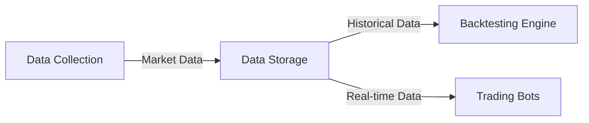
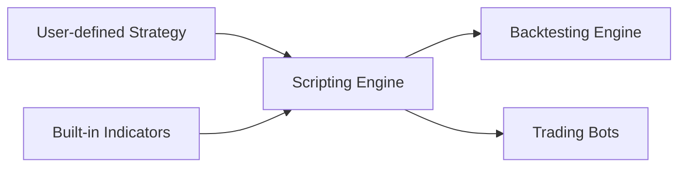
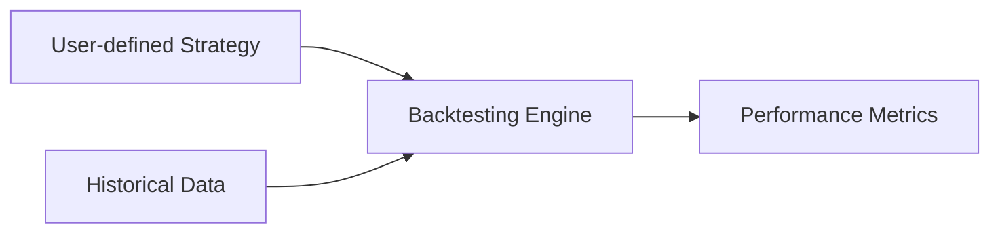
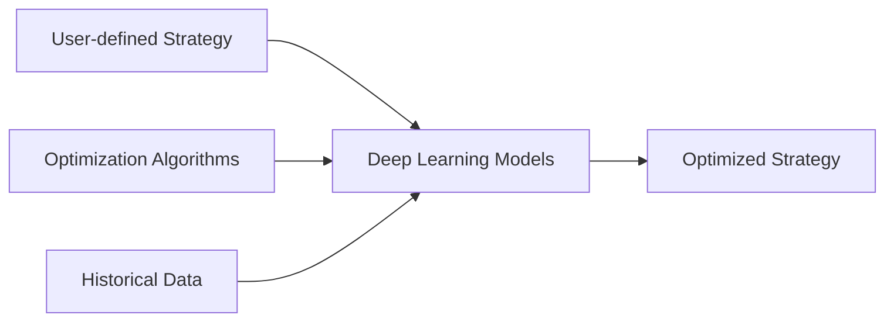
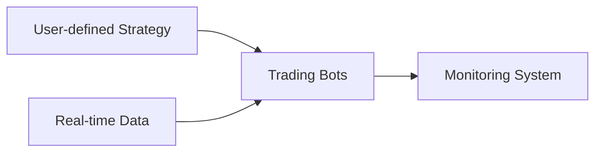
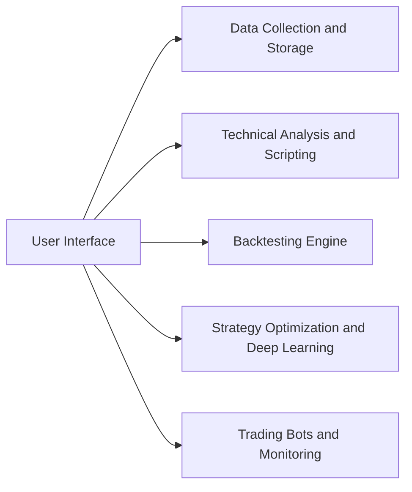

# **Torch Trader: Detailed Design**

## **1. Introduction**

This detailed design document provides a comprehensive blueprint for the implementation of the Torch Trader platform, a next-generation trading solution that supports stocks and cryptocurrencies. Torch Trader aims to offer a comprehensive, high-performance, and user-friendly trading environment by leveraging advanced analytics, backtesting, deep learning, and trading bot automation. This document outlines the structure, components, and interactions within the platform, along with Mermaid diagrams to illustrate the workflows and relationships.

## **2. System Components**

The Torch Trader platform consists of the following key components:

1. Data Collection and Storage
2. Technical Analysis and Scripting
3. Backtesting Engine
4. Strategy Optimization and Deep Learning
5. Trading Bots and Monitoring
6. User Interface
7. Support and Maintenance

### **2.1 Data Collection and Storage**

#### **2.1.1 Data Collection**

Data Collection integrates popular APIs like Alpha Vantage, Yahoo Finance, and Binance to gather market data. This component should handle API rate limits and data normalization.

* **Class**: `DataCollector`
    * **Methods**:
        * `collect_data(symbol, start_date, end_date, interval)`: Collects market data for the specified symbol and date range, returning a DataFrame or similar data structure.
        * `normalize_data(data)`: Normalizes the collected data to a standardized format.

#### **2.1.2 Data Storage**

Data Storage manages collected data in a structured format, such as CSV files or a database like SQLite or PostgreSQL.

* **Class**: `DataStorage`
    * **Methods**:
        * `store_data(data, symbol, start_date, end_date, interval)`: Stores the collected data in the specified format and location.
        * `load_data(symbol, start_date, end_date, interval)`: Retrieves stored data for the specified symbol and date range, returning a DataFrame or similar data structure.

### **2.2 Technical Analysis and Scripting**

#### **2.2.1 Technical Analysis**

Technical Analysis provides a library of built-in technical indicators using TA-Lib or Tulipy.

* **Module**: `technical_analysis`
    * **Functions**:
        * `moving_average(data, period)`: Calculates the moving average for the given data and period.
        * `rsi(data, period)`: Calculates the Relative Strength Index (RSI) for the given data and period.
        * `macd(data, short_period, long_period, signal_period)`: Calculates the Moving Average Convergence Divergence (MACD) for the given data and periods.

#### **2.2.2 Scripting Engine**

Scripting Engine allows users to create, edit, and manage custom trading strategies using Python scripts.

* **Class**: `ScriptingEngine`
    * **Methods**:
        * `load_strategy(file_path)`: Loads a user-defined strategy from a Python script file.
        * `evaluate_strategy(strategy, data)`: Evaluates the loaded strategy on the provided data, returning trade signals or other strategy outputs.

#### **2.3.1 Backtesting**

The Backtesting component simulates trading with historical data and evaluates the performance of user-defined strategies. This component should be implemented using libraries like Backtrader, PyAlgoTrade, or Zipline.

* **Class**: `BacktestingEngine`
    * **Methods**:
        * `run_backtest(strategy, data)`: Executes the backtesting process using the provided strategy and historical data.
        * `get_trade_logs()`: Retrieves the trade logs generated during the backtesting process.
        * `get_performance_metrics()`: Calculates and returns the performance metrics for the backtested strategy.

### **2.4 Strategy Optimization and Deep Learning**

#### **2.4.1 Deep Learning**

The Deep Learning component implements deep learning models using PyTorch for strategy optimization.

* **Class**: `DeepLearningOptimizer`
    * **Methods**:
        * `train_model(strategy, data)`: Trains a deep learning model on the given strategy and data.
        * `optimize_strategy(strategy)`: Applies the trained model to the strategy, returning an optimized version of the strategy.

#### **2.4.2 CUDA Support**

The platform should enable GPU acceleration with CUDA for high-performance model training.

* **Module**: `cuda_support`
    * **Functions**:
        * `initialize_cuda()`: Initializes the CUDA environment and verifies compatibility with the user's system.
        * `check_cuda_availability()`: Checks if CUDA is available and supported on the user's system.

#### **2.4.3 Optimization Algorithms**

The platform should apply optimization algorithms like grid search or Bayesian optimization to fine-tune strategies.

* **Class**: `StrategyOptimizer`
    * **Methods**:
        * `grid_search(strategy, parameter_grid)`: Applies a grid search algorithm to optimize the strategy based on the provided parameter grid.
        * `bayesian_optimization(strategy, parameter_bounds)`: Applies a Bayesian optimization algorithm to optimize the strategy based on the provided parameter bounds.

### **2.5 Trading Bots and Monitoring**

#### **2.5.1 Trading Bots**

The Trading Bots component develops trading bots capable of executing trades on popular stock and crypto exchanges using their APIs.

* **Class**: `TradingBot`
    * **Methods**:
        * `configure_strategy(strategy)`: Configures the trading bot to use the provided strategy.
        * `execute_trade(signal)`: Executes a trade based on the provided trade signal.

#### **2.5.2 Monitoring System**

The Monitoring System component implements a system to track bot performance, including profit/loss, trade history, and strategy performance.

* **Class**: `MonitoringSystem`
    * **Methods**:
        * `track_trade(bot_id, trade_details)`: Records trade details for the specified bot.
        * `get_bot_performance(bot_id)`: Retrieves the performance metrics for the specified bot.
        * `get_trade_history(bot_id)`: Retrieves the trade history for the specified bot.

### **2.6 User Interface**

The User Interface component provides an intuitive and responsive interface for users to interact with the platform.

#### **2.6.1 Interface Options**

The platform should support multiple interface options, including a command-line interface, a web-based interface using Flask or Django, or a desktop application using PyQt or Tkinter.

* **Module**: `command_line_interface`
    * **Functions**:
        * `main_menu()`: Displays the main menu for the command-line interface, allowing users to access various features.
* **Module**: `web_interface`
    * **Functions**:
        * `create_app()`: Creates and initializes the web application using Flask or Django.
* **Module**: `desktop_interface`
    * **Functions**:
        * `create_app()`: Creates and initializes the desktop application using PyQt or Tkinter.

#### **2.6.2 User Experience**

The user interface should be designed with a focus on usability, accessibility, and responsiveness for both novice and experienced traders.

* **Class**: `UserInterface`
    * **Methods**:
        * `display_data(data)`: Displays the provided data in a user-friendly format.
        * `display_backtest_results(results)`: Presents the backtesting results, including performance metrics, trade logs, and visualizations.
        * `display_bot_performance(bot_id)`: Shows the performance metrics, profit/loss, and trade history for the specified trading bot.

## **3. Conclusion**

The detailed design for the Torch Trader platform provides a comprehensive blueprint for implementing a powerful and user-friendly trading solution. By combining modular components, a flexible deployment architecture, and a focus on user experience, the platform is designed to cater to the needs of various users, from individual traders to professional institutions. With the provided Mermaid diagrams and implementation details, developers can confidently build the Torch Trader platform to offer a cutting-edge and adaptable solution for the ever-changing world of stock and cryptocurrency trading.
