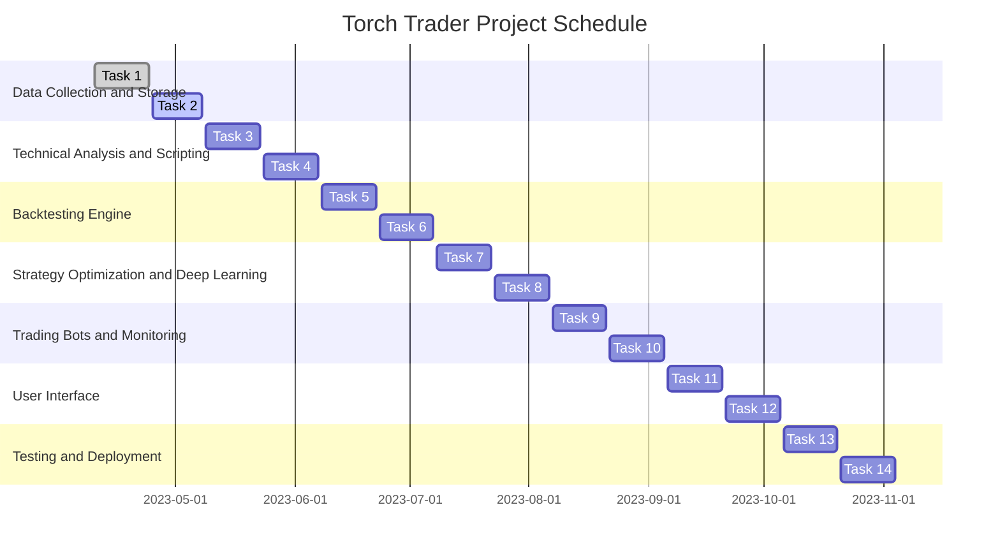

# **Torch Trader: Project Plan**

## **1. Introduction**

This project plan outlines the steps required to develop and deploy the Torch Trader platform, a comprehensive trading solution that supports stocks and cryptocurrencies. Torch Trader aims to provide a powerful, high-performance, and user-friendly trading environment by leveraging advanced analytics, backtesting, deep learning, and trading bot automation. This document provides an overview of the project's objectives, resources, schedule, and risk management, along with Mermaid diagrams to illustrate the workflows and milestones.

## **2. Project Objectives**

The primary objectives of the Torch Trader project are:

1. Develop a comprehensive trading solution for stocks and cryptocurrencies.
2. Implement advanced analytics, backtesting, deep learning, and trading bot automation.
3. Deliver a user-friendly and high-performance platform.
4. Provide flexible deployment options, including local, cloud, and hybrid configurations.
5. Ensure maintainability, extensibility, and scalability of the platform.

## **3. Project Resources**

The project resources include:

1. Development Team: Skilled Python developers, data scientists, and UI/UX designers.
2. External Libraries and Frameworks: PyTorch, TA-Lib, Tulipy, Backtrader, PyAlgoTrade, Zipline, Flask, Django, PyQt, and Tkinter.
3. APIs and Data Sources: Alpha Vantage, Yahoo Finance, and Binance.
4. Hardware: Local development machines, cloud infrastructure (AWS, GCP, or Azure), and GPU support with CUDA.
5. Project Management Tools: Version control (Git), task management (Trello), and communication (Slack).

## **4. Project Schedule**

### **4.1 Milestones**

1. Data Collection and Storage (2023-04-10 to 2023-05-08)
    * Collect market data from stock and crypto markets.
    * Store historical and real-time data in a structured format.
2. Technical Analysis and Scripting (2023-05-09 to 2023-06-07)
    * Implement built-in technical indicators.
    * Enable users to create, edit, and manage custom trading strategies.
3. Backtesting Engine (2023-06-08 to 2023-07-07)
    * Simulate trading with historical data.
    * Evaluate the performance of user-defined strategies.
4. Strategy Optimization and Deep Learning (2023-07-08 to 2023-08-06)
    * Implement deep learning models for strategy optimization.
    * Support GPU acceleration with CUDA.
    * Apply optimization algorithms to fine-tune strategies.
5. Trading Bots and Monitoring (2023-08-07 to 2023-09-05)
    * Develop trading bots for popular stock and crypto exchanges.
    * Implement a monitoring system for bot performance.
6. User Interface (2023-09-06 to 2023-10-05)
    * Design and implement a user-friendly and responsive interface.
    * Support multiple interface options, including command-line, web, and desktop.
7. Testing and Deployment (2023-10-06 to 2023-11-04)
    * Perform thorough testing of the platform.
    * Deploy the platform to local, cloud, or hybrid environments, depending on user requirements.

## **5. Risk Management**

### **5.1 Risk Identification**

1. Technical Risks: Potential difficulties in integrating various libraries, frameworks, and APIs.
2. Schedule Risks: Delays in development or unforeseen challenges that may impact the project timeline.
3. Resource Risks: Availability and performance of development resources, such as skilled personnel or hardware infrastructure.
4. Security Risks: Vulnerabilities in the platform, including data protection and privacy concerns.
5. Legal and Regulatory Risks: Compliance with applicable laws and regulations related to trading, data usage, and privacy.

### **5.2 Risk Assessment and Mitigation**

#### **5.2.1 Technical Risks**

* **Assessment**: Integration of multiple libraries, frameworks, and APIs may cause compatibility issues or unexpected behavior.
* **Mitigation**: Careful planning of the platform's architecture, thorough research on library compatibility, and proper error handling.

#### **5.2.2 Schedule Risks**

* **Assessment**: Delays in development or unforeseen challenges may cause the project to miss deadlines or exceed the budget.
* **Mitigation**: Implement agile development methodologies, allocate sufficient time for testing and debugging, and maintain open communication within the team.

#### **5.2.3 Resource Risks**

* **Assessment**: Insufficient or underperforming resources, such as skilled personnel or hardware infrastructure, may impact project quality or completion.
* **Mitigation**: Ensure adequate staffing and hardware resources, provide training for team members, and monitor resource utilization throughout the project.

#### **5.2.4 Security Risks**

* **Assessment**: Potential vulnerabilities in the platform may lead to data breaches, unauthorized access, or other security threats.
* **Mitigation**: Implement robust security measures, perform regular security audits, and educate team members on security best practices.

#### **5.2.5 Legal and Regulatory Risks**

* **Assessment**: Failure to comply with applicable laws and regulations may result in fines, penalties, or damage to the project's reputation.
* **Mitigation**: Conduct thorough research on relevant laws and regulations, consult legal experts as needed, and incorporate compliance measures into the platform's design.

## **6. Conclusion**

The Torch Trader project plan outlines a detailed roadmap for developing and deploying a comprehensive trading platform that caters to a wide range of users, from novice traders to professional institutions. By following the outlined schedule, milestones, and risk management strategies, the development team can successfully deliver a powerful, user-friendly, and high-performance trading solution that leverages advanced analytics, backtesting, deep learning, and trading bot automation to meet the ever-evolving demands of the stock and cryptocurrency markets.
