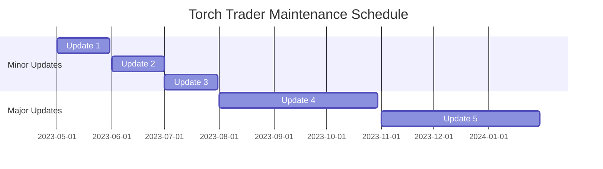

# **Torch Trader: Maintenance and Support Plan**

The Torch Trader Maintenance and Support Plan outlines our commitment to providing high-quality support and maintenance services to our users. This plan covers our approach to software updates, bug fixes, performance improvements, and user support.

## **Table of Contents**

1. [Introduction](https://chat.openai.com/chat/ef63bbac-4597-48f5-8c19-01d87627dc52#introduction)
2. [Software Updates](https://chat.openai.com/chat/ef63bbac-4597-48f5-8c19-01d87627dc52#software-updates)
    * [Minor Updates](https://chat.openai.com/chat/ef63bbac-4597-48f5-8c19-01d87627dc52#minor-updates)
    * [Major Updates](https://chat.openai.com/chat/ef63bbac-4597-48f5-8c19-01d87627dc52#major-updates)
3. [Bug Fixes and Performance Improvements](https://chat.openai.com/chat/ef63bbac-4597-48f5-8c19-01d87627dc52#bug-fixes-and-performance-improvements)
4. [User Support](https://chat.openai.com/chat/ef63bbac-4597-48f5-8c19-01d87627dc52#user-support)
    * [Documentation](https://chat.openai.com/chat/ef63bbac-4597-48f5-8c19-01d87627dc52#documentation)
    * [Community Support](https://chat.openai.com/chat/ef63bbac-4597-48f5-8c19-01d87627dc52#community-support)
    * [Email Support](https://chat.openai.com/chat/ef63bbac-4597-48f5-8c19-01d87627dc52#email-support)
5. [Maintenance Schedule](https://chat.openai.com/chat/ef63bbac-4597-48f5-8c19-01d87627dc52#maintenance-schedule)
6. [Conclusion](https://chat.openai.com/chat/ef63bbac-4597-48f5-8c19-01d87627dc52#conclusion)

## **1. Introduction**

The primary goal of the Torch Trader Maintenance and Support Plan is to ensure the platform remains up-to-date, secure, and reliable while providing timely and effective support to our users. This plan outlines our approach to achieving these goals through regular software updates, prompt bug fixes, performance improvements, and various support channels.

## **2. Software Updates**

Torch Trader will receive regular software updates to introduce new features, improvements, and bug fixes. Updates are categorized into two types:

### **2.1 Minor Updates**

Minor updates include bug fixes, security patches, and minor improvements to existing features. These updates are typically released on a monthly basis or as needed to address urgent issues.

### **2.2 Major Updates**

Major updates introduce significant new features, enhancements, and architectural changes to the platform. These updates are released on a semi-annual basis or as determined by the development roadmap.

## **3. Bug Fixes and Performance Improvements**

Our team is committed to promptly addressing and resolving any issues discovered in Torch Trader. Users are encouraged to report bugs and performance issues through our GitHub repository's issue tracker or by contacting our support team via email. We aim to address critical issues within one week and other issues within two to four weeks, depending on the severity and complexity of the problem.

## **4. User Support**

Torch Trader offers several support channels to assist users with technical issues, feature requests, and general inquiries.

### **4.1 Documentation**

Our comprehensive documentation includes user guides, developer documentation, API references, and troubleshooting guides. Users are encouraged to consult the documentation for answers to common questions and guidance on using Torch Trader's features.

### **4.2 Community Support**

The Torch Trader community forum is a valuable resource for users to ask questions, share tips, and engage with other Torch Trader users. Our team actively monitors the forum and provides assistance as needed.

### **4.3 Email Support**

For more personalized support or inquiries not covered by the documentation or community forum, users can contact our support team via email at support@torchtrader.com.

## **5. Maintenance Schedule**

To minimize disruptions, we will schedule maintenance activities during off-peak hours or weekends. In the event of critical updates or emergency maintenance, we will provide users with advance notice via email and in-app notifications.

## **6. Conclusion**

The Torch Trader Maintenance and Support Plan demonstrates our commitment to delivering a high-quality, reliable, and secure trading platform to our users. By providing regular software updates, prompt bug fixes, performance improvements, and multiple support channels, we aim to ensure a positive user experience and a robust trading environment.

We encourage users to provide feedback and report any issues they encounter, as this will help us continue to refine and enhance the platform. Our team is dedicated to the ongoing development of Torch Trader and to providing exceptional support to our growing community of users.
