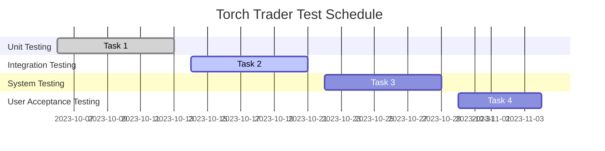

# **Torch Trader: Test Plan**

## **1. Introduction**

This test plan outlines the testing strategy, objectives, scope, and schedule for the Torch Trader platform, a comprehensive trading solution for stocks and cryptocurrencies. The platform aims to provide advanced analytics, backtesting, deep learning, and trading bot automation in a user-friendly and high-performance environment. This document details the types of tests to be performed, the test deliverables, and the resources required to ensure a robust, reliable, and secure trading platform.

## **2. Test Objectives**

The primary objectives of the testing process are:

1. Validate that the platform meets the functional requirements and design specifications.
2. Ensure the platform's performance, reliability, and stability under various conditions.
3. Verify the platform's usability, accessibility, and responsiveness.
4. Assess the platform's security and data protection measures.
5. Identify and address potential defects, vulnerabilities, and issues.

## **3. Test Scope**

The testing process will cover the following components and functionalities of the Torch Trader platform:

1. Data Collection and Storage
2. Technical Analysis and Scripting
3. Backtesting Engine
4. Strategy Optimization and Deep Learning
5. Trading Bots and Monitoring
6. User Interface

## **4. Test Deliverables**

The test deliverables include:

1. Test cases and scripts
2. Test data and environments
3. Test results and reports
4. Defect reports and resolution logs
5. Test summary and evaluation

## **5. Test Schedule**

### **5.1 Milestones**

1. Unit Testing (2023-10-06 to 2023-10-13)
    * Test individual components and functions for correctness and reliability.
2. Integration Testing (2023-10-14 to 2023-10-21)
    * Test the interaction and integration of various components and modules.
3. System Testing (2023-10-22 to 2023-10-29)
    * Test the entire platform for performance, reliability, and stability.
4. User Acceptance Testing (2023-10-30 to 2023-11-04)
    * Test the platform's usability, accessibility, and responsiveness with end-users.

## **6. Test Resources**

The test resources include:

1. Test Team: Skilled test engineers and QA professionals.
2. Test Environments: Local, cloud, and hybrid deployment configurations.
3. Test Tools: Test case management (TestRail), defect tracking (Jira), and test automation (Selenium, Pytest).
4. Test Data: Historical and real-time market data from stock and crypto markets.

## **7. Test Strategy**

The test strategy encompasses several testing levels, including unit testing, integration testing, system testing, and user acceptance testing. The testing process will involve both manual and automated testing techniques to ensure comprehensive coverage and efficient defect detection.

### **7.1 Unit Testing**

* **Objective**: Validate the correctness and reliability of individual components and functions.
* **Approach:** Perform functional and boundary testing on individual functions and modules.
* **Tools**: Pytest, unittest, or other Python-based testing frameworks.
* **Deliverables**: Test cases, test scripts, and test results.

###
    **7.2 Integration Testing**

* **Objective**: Verify the interaction and integration of various components and modules within the platform.
* **Approach**: Perform interface, communication, and data flow testing between the different components and modules.
* **Tools**: Pytest, unittest, or other Python-based testing frameworks.
* **Deliverables**: Test cases, test scripts, and test results.

###
    **7.3 System Testing**

* **Objective**: Assess the platform's performance, reliability, and stability as a whole.
* **Approach**: Perform load testing, stress testing, and endurance testing to evaluate the platform's performance under various conditions.
* **Tools**: JMeter, Locust, or other performance testing tools.
* **Deliverables**: Test cases, test scripts, and test results.

###
    **7.4 User Acceptance Testing**

* **Objective**: Validate the platform's usability, accessibility, and responsiveness for end-users.
* **Approach**: Perform usability testing, accessibility testing, and compatibility testing with different browsers, operating systems, and devices.
* **Tools**: Selenium WebDriver, JAWS, or other accessibility and compatibility testing tools.
* **Deliverables**: Test cases, test scripts, and test results.

##
    **8. Test Metrics and Evaluation**

The test metrics and evaluation criteria will be used to assess the quality and success of the testing process. Key metrics include:

1. Test Coverage: The percentage of functional requirements and design specifications covered by test cases.
2. Defect Density: The number of defects identified per unit of code or functionality.
3. Defect Removal Efficiency: The ratio of defects detected during testing to the total number of defects found.
4. Mean Time Between Failures (MTBF): The average time between system failures during system testing.
5. Test Execution Time: The total time taken to execute all test cases.

The test results will be compared against the established quality objectives and requirements to determine the overall success of the testing process and the readiness of the platform for deployment.

##
    **9. Conclusion**

The Torch Trader test plan provides a comprehensive testing strategy to ensure a robust, reliable, and secure trading platform. By adhering to the outlined test schedule, milestones, and resource allocation, the test team can effectively identify and address potential defects, vulnerabilities, and issues. This rigorous testing process will contribute to the successful delivery of a high-quality trading solution that meets the needs of its users and achieves the ambitious goals of the Torch Trader project.
