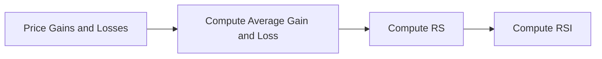

<!-----

Yay, no errors, warnings, or alerts!

Conversion time: 0.502 seconds.


Using this Markdown file:

1. Paste this output into your source file.
2. See the notes and action items below regarding this conversion run.
3. Check the rendered output (headings, lists, code blocks, tables) for proper
   formatting and use a linkchecker before you publish this page.

Conversion notes:

* Docs to Markdown version 1.0β34
* Wed Apr 05 2023 08:33:19 GMT-0700 (PDT)
* Source doc: RSI
----->


# RSI Indicator

The Relative Strength Index (RSI) is a technical analysis indicator that measures the speed and change of price movements. It was developed by J. Welles Wilder Jr. and introduced in his 1978 book "New Concepts in Technical Trading Systems". The RSI is a momentum oscillator that ranges between 0 and 100 and is primarily used to identify overbought or oversold conditions in a security.

## Overview

The RSI calculates the ratio of the average price gains to the average price losses over a specified period, usually 14 days. The RSI oscillates between 0 and 100, with readings above 70 generally considered overbought and readings below 30 considered oversold.




## Implementation

Our implementation uses PyTorch to compute the RSI indicator. The code defines a class called `RSI` that inherits from the `nn.Module` class. The `RSI` class has a forward method that takes two arguments: `window_size` and `prices`.


### Main Steps


1. Compute the individual gains and losses for each price change.
2. Calculate the average gain and loss using a moving average with the specified window size.
3. Compute the Relative Strength (RS) as the ratio of the average gain to the average loss.
4. Calculate the RSI using the RS value.


### Code Structure

The RSI class has the following methods:


* `__init__`: Initializes the RSI class and sets the `window_size` attribute to `None`.
* `forward`: Takes `prices` and `window_size` as input arguments, sets the `window_size` attribute, and computes the RSI.
* `compute_individual_gains_losses`: Takes `gains_losses` as input and returns the individual gains and losses.
* `compute_avg_gain_loss`: Takes `gains` and `losses` as input and returns the average gain and loss.
* `compute_rs`: Takes `avg_gain` and `avg_loss` as input and returns the Relative Strength (RS).
* `compute_rsi`: Takes `rs` as input and returns the RSI value.


### Example Usage

```python
import torch from torch.jit import script

# Set the seed
torch.manual_seed(42)
# Generate random test prices
prices = torch.randn(100)
# Prepare the RSI class for TorchScript
scripted_rsi_calculator = script(RSI())
window_size = 14
scripted_rsi = scripted_rsi_calculator(prices, window_size)
print(scripted_rsi)
```


This example demonstrates how to use the RSI class with TorchScript to compute the RSI indicator for a sequence of 100 random prices.


::: torchtrader.ta.rsi
